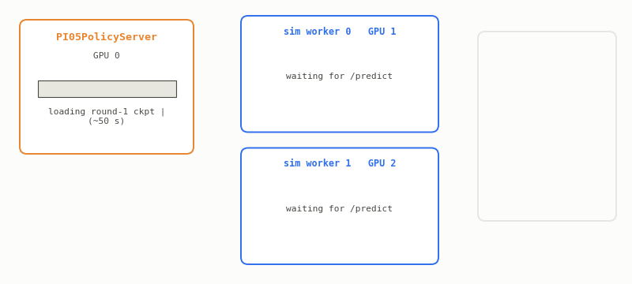

# Scaling Physical AI & Robotics Systems with Ray

An end-to-end physical-AI workflow on **Ray + Anyscale**, taught as a series of
self-contained, runnable notebooks. You stream robotics data, fine-tune a
Vision-Language-Action (VLA) policy, serve it and evaluate it in simulation,
close the loop by folding sim trajectories back into training, pre-train a
**world model** at scale, and finally **distill** a large model into a small
backbone you could deploy on a robot.

> **Scale up to learn; scale down to deploy.**

The point of the course is the **infrastructure**. The models (PI0.5, V-JEPA,
ResNet/MobileNet) are the workload; the lesson is how a handful of Ray
primitives (**Ray Data**, **Ray Train**, **Ray Serve**, and **Ray remote
tasks**) handle streaming data, distributed training, live serving, and
parallel simulation on one cluster. Swap in your own models and the
orchestration code barely changes.

<p align="center">
  
</p>
<p align="center">
  <sub>One cluster: a policy server on one GPU, Isaac Lab
  simulators fanned out on the rest, all of it handed back when the phase ends.</sub>
</p>

**Start here:** open [`00_overview.ipynb`](./00_overview.ipynb) and read forward.
There is nothing to install first. The course image carries every dependency, no
Hugging Face token is needed, and each notebook connects to the running cluster in
its own first cell. The agent setup further down applies only to the optional
SmolVLA track.

---

## The lifecycle

```
   ┌─────────┐   ┌──────────────┐   ┌────────────┐   ┌─────────────┐
   │  DATA   │──▶│  FINE-TUNE   │──▶│   SERVE    │──▶│   SIMULATE  │
   │ Ray Data│   │  a VLA       │   │ the policy │   │  & evaluate │
   │ stream  │   │  Ray Train   │   │ Ray Serve  │   │ Ray tasks   │
   └─────────┘   └──────────────┘   └────────────┘   └──────┬──────┘
        ▲                                                    │
        │                  CLOSE THE LOOP                    │
        └───────────  filter by reward, union  ◀────────────┘
                              │
            ┌─────────────────┴───────────────────┐
            ▼                                      ▼
   ┌──────────────────┐                  ┌────────────────────┐
   │  WORLD MODEL     │                  │   DISTILL FOR EDGE │
   │  pre-train at    │  ───────────▶    │  big teacher →     │
   │  scale (V-JEPA)  │   scale down     │  small student     │
   │  Ray Train       │                  │  Ray Train         │
   └──────────────────┘                  └────────────────────┘
```

---

## Course map

| # | Notebook | You learn | Ray primitive |
|---|----------|-----------|---------------|
| 00 | `00_overview.ipynb` | The lifecycle, the through-line, how to navigate | n/a |
| 01 | `01_robotics_data_pipelines.ipynb` | Stream LeRobot v3 video, partition, preprocess | **Ray Data** |
| 02 | `02_vla_finetuning.ipynb` | Distributed DDP fine-tune of PI0.5 (3.4B) | **Ray Train** |
| 03 | `03_serving_and_sim_eval.ipynb` | Serve the policy + fan out Isaac Lab rollouts + close the loop | **Ray Serve**, **Ray tasks** |
| 04 | `04_world_model_pretraining.ipynb` | Pre-train a V-JEPA world model + online adaptation | **Ray Data**, **Ray Train** |
| 05 | `05_distillation_for_edge.ipynb` | Distill a large teacher into a deployable student | **Ray Data**, **Ray Train** |

**Outline coverage:** robotics data prep (01) · VLA pre-training & fine-tuning
(02 fine-tune, 04 pre-train) · distributed simulation & evaluation (03) ·
scalable inference (03 serving, 05 edge) · world-foundation model pre-training
at scale (04).

### What comes out of the loop

Every sim worker saves the episode it rolled out, so each round of notebook 03
hands you the Franka arm actually being driven by the policy you just trained:

<table>
<tr>
<td align="center" width="50%">
  <br>
  <sub><b>Round 1.</b> Policy fine-tuned on LIBERO only.</sub>
</td>
<td align="center" width="50%">
  <br>
  <sub><b>Round 2.</b> After rewarded sim episodes were folded back into training.</sub>
</td>
</tr>
</table>

These are smoke-scale runs of 50 steps, so expect exploratory motion rather than
a clean pick. What is being demonstrated is the loop: serve, roll out, filter by
reward, `union()` into the training stream, retrain, and compare under identical
seeds. See [A note on scope](#a-note-on-scope) for why the motion looks this way.

The notebooks are designed to be read in order, and they cross-reference each
other. They ship **pre-run:** every notebook has committed outputs, so you can
read the whole story without a cluster, then re-run any of them on your own.

> **A note on the figures and committed outputs.** The diagrams, logs, and cell
> outputs throughout this course were captured on the **minimum supported
> configuration** (2 GPUs, one per node) and illustrate the smallest shape the
> workflow takes. They are not a ceiling: the same code paths scale to larger
> clusters with no edits: more Ray Train workers as you add GPUs, and more parallel
> simulators as you add GPU nodes. Expect your own run's
> worker counts, throughput, and timings to differ from the printed ones
> accordingly. See [Cluster](#cluster) for exactly what changes with GPU count.

---

## Agent-led track: SmolVLA fine-tuning

Running alongside the notebooks is an **agent-led** exercise. Instead of stepping
through cells yourself, you point a coding agent at Anyscale and have it fine-tune
**SmolVLA**, a compact VLA policy, on the same LeRobot data this course streams.

The agent does the work you would otherwise do by hand: pick the compute, write
the job config, launch it, watch the logs, and report back what it got. That is
what `anyscale skills install` in the box below is for. It gives whichever
agent you installed the Anyscale platform skills, so it knows how to build a
Ray Train workload, submit it, and read the result.

Same lesson as the rest of the course, arrived at from the other direction: the
orchestration is config, not code, which is exactly why an agent can drive it.

> ### Setup: install your agent
>
> Install one agent CLI, then the Anyscale skills. Copy and paste as is.
>
> **Quick path.** Claude Code is standalone and needs no Node:
>
> ```bash
> curl -fsSL https://claude.ai/install.sh | bash   # skip if using codex/cursor
> pip install -U anyscale
> anyscale login
> anyscale skills install -p claude-code -p cursor -p codex --accept-terms
> ```
>
> **Using a different agent?** Install its CLI, then run the three `anyscale`
> commands above:
>
> ```bash
> # Claude Code, standalone, no Node needed
> curl -fsSL https://claude.ai/install.sh | bash
>
> # Cursor CLI (cursor-agent), standalone, no Node needed
> curl https://cursor.com/install -fsS | bash
>
> # Codex CLI, npm package, needs Node
> npm install -g @openai/codex
>
> # Copilot CLI, npm package, needs Node
> npm install -g @github/copilot
> ```
>
> `anyscale skills install` is what teaches your agent this platform, so run it
> no matter which CLI you picked.

---

## Shared modules

| File | Used by | Role |
|------|---------|------|
| `lerobot_datasource.py` | 01/02/03/04 | Ray Data `Datasource` for LeRobot v3 (streaming parquet + mp4) |
| `cluster.py` | 00–05 | Reads the live cluster shape; derives every train/sim worker count |
| `util.py` | 02/03 | Model load/freeze, checkpoint I/O, LR schedule, node staging |
| `policy_server.py` | 03 | `@serve.deployment` PI0.5 HTTP policy server |
| `franka_env.py` | 03 | Isaac Lab `Isaac-Lift-Cube-Franka-v0` wrapper |
| `sim_worker.py` | 03 | Standalone subprocess: boots Isaac Lab, queries Serve, saves GIF + trajectory |

---

## Prerequisites

### Cluster

An Anyscale cluster with **2 or 4 GPU workers**, running the image defined in
[`Dockerfile`](./Dockerfile). The head node is CPU-only; the GPU workers are accessed via Ray.

**Supported instance types:** any of these runs the full course:

| Instance | GPUs per node | GPU | VRAM |
|---|---|---|---|
| `g4dn.xlarge` | 1 | T4 | 16 GB |
| `g4dn.2xlarge` | 1 | T4 | 16 GB |
| `g5.2xlarge` | 1 | A10G | 24 GB |
| `g6.12xlarge` | 4 | L4 | 24 GB |
| `g7.2xlarge` | 1 | Blackwell-class | 24 GB+ |
| `g7e.4xlarge` | 1 | RTX PRO 6000 | 96 GB |

So a cluster is 2 or 4 single-GPU nodes, or a single `g6.12xlarge` carrying all 4 GPUs. The
notebooks treat these identically.

**Nothing in this course is pinned to a GPU count, a GPU model, or an instance type.** Every
worker count is derived from the live cluster at runtime by [`cluster.py`](./cluster.py):

| Setting | Derived as | 2 GPUs | 4 GPUs |
|---|---|---|---|
| Ray Train workers (02, 04, 05) | one per GPU | 2 | 4 |
| Sim workers (03) | one per GPU node, at most GPUs − 1 | 1 | 1 on one node, 3 across four |
| Effective batch (02) | `batch_size(1) × grad_accum(16) × workers` | 32 | 64 |

Every notebook opens with `cluster.describe()`, which prints the GPU count, GPU model, and
per-node layout it found, along with the worker counts derived from them. Set `NUM_WORKERS` or
`SIM_WORKERS` in the environment to pin a run smaller than the cluster.

Resource use is phased so the cluster is never over-subscribed, whatever its size:

| Phase | GPUs used | On 2 GPUs | On 4 GPUs |
|-------|-----------|-----------|-----------|
| Training (Ray Train DDP) | all of them | 2 workers | 4 workers |
| Sim eval (1 Serve replica + N sim workers) | replica plus one rollout per remaining GPU node | 1 replica + 1 sim | 1 replica + 1 sim on a g6.12xlarge |

Ray releases GPUs between phases.

**No credentials of any kind.** Datasets, the PI0.5 weights, and the PaliGemma tokenizer all
come from a public S3 mirror (`s3://anyscale-public-materials-use2/ray_summit_robotics_2026/`)
read unsigned, and the notebooks run with `HF_HUB_OFFLINE=1`, so no Hugging Face token is
needed at run time or build time. (`google/paligemma-3b-pt-224` is redistributed under the
Gemma Terms of Use; see `GEMMA_NOTICE.txt` at that prefix.)

### Tested configuration

| Component | Version |
|-----------|---------|
| Ray | 2.53.0. & 2.55.0 |
| Python | 3.11 |
| PyTorch | 2.7.0 + CUDA 12.8 |
| Isaac Sim | 5.1.0 |
| Isaac Lab | 0.54.4 (`main@b0542fe`, pinned commit, built from source) |
| lerobot | 0.4.3 (`--no-deps`) |
| transformers | `huggingface/transformers@dcddb97` (patched fork, pinned commit) |

**Why the patched transformers fork?** PI0.5's checkpoint stores Gemma
layernorm parameters under a different key layout than mainline `transformers
>= 4.57`, and `PI05Pytorch.__init__` aborts unless `transformers.models.siglip.check`
exists, a symbol only in the fork.

**Why `lerobot --no-deps`?** lerobot's `rerun-sdk` dependency requires
`numpy >= 2`, which breaks Isaac Sim's compiled ABI. Install `--no-deps` and
pin `numpy>=1.26,<2`.

**Why `TORCHDYNAMO_DISABLE=1`?** PI0.5 calls `torch.compile` internally; the
worker nodes have no C compiler, so dynamo falls back to eager cleanly.

### Cluster image (Dockerfile)

The image is defined by [`Dockerfile`](./Dockerfile) in this directory, which is the single
source of truth; build that file as-is.

Two things worth knowing before you build:

- **The NVIDIA graphics-userspace block is required.** The container runtime injects only
  *compute* driver libs, so the Dockerfile bakes the graphics libs Isaac Sim's Vulkan/RTX
  renderer needs from the version-matched driver `.run`. `NV_DRIVER_VERSION` tracks the host
  driver reported by `nvidia-smi --query-gpu=driver_version --format=csv,noheader`.
- **Isaac Lab is pinned to a tag and the transformers fork to a commit**, so independent builds
  resolve to the same code instead of tracking a moving branch.

(No Weights & Biases in the tutorial; metrics are reported through Ray Train. `wandb` is
installed only because lerobot expects it to be importable.)

---

## A note on scope

Both the LIBERO training data and Isaac Lab's `Isaac-Lift-Cube-Franka-v0` use a
**Franka Panda**, so the action and state dimensions line up cleanly. What PI0.5
has *not* seen is this exact setup: Isaac Lab's action/control convention, scene
and coordinate frame, and camera views (we feed one render into both of PI0.5's
camera inputs). So in 02/03 expect **exploratory motion, not task success**: we're
validating the **orchestration loop**, not manipulation skill. Every run here is
at smoke scale (small step counts); the lesson is that the *same code* scales to
production by changing config, not logic.
